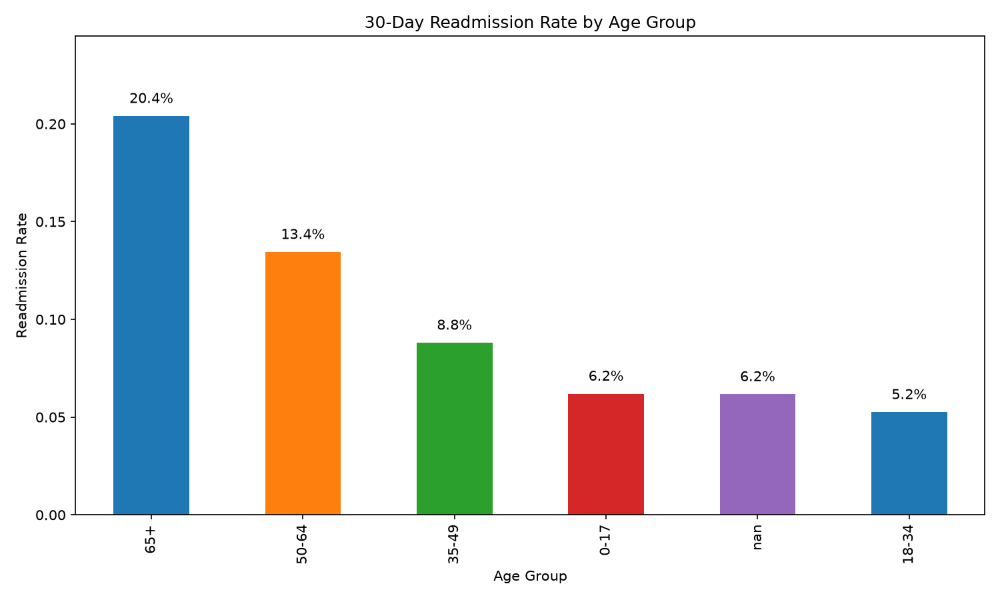
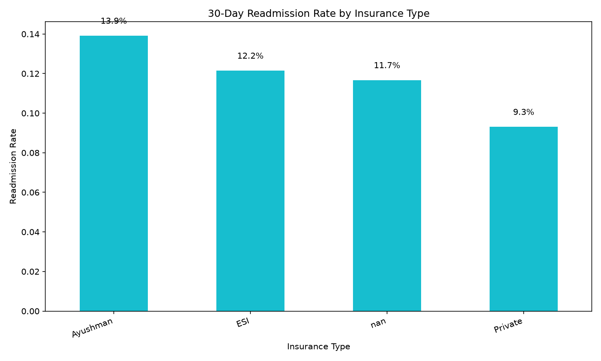
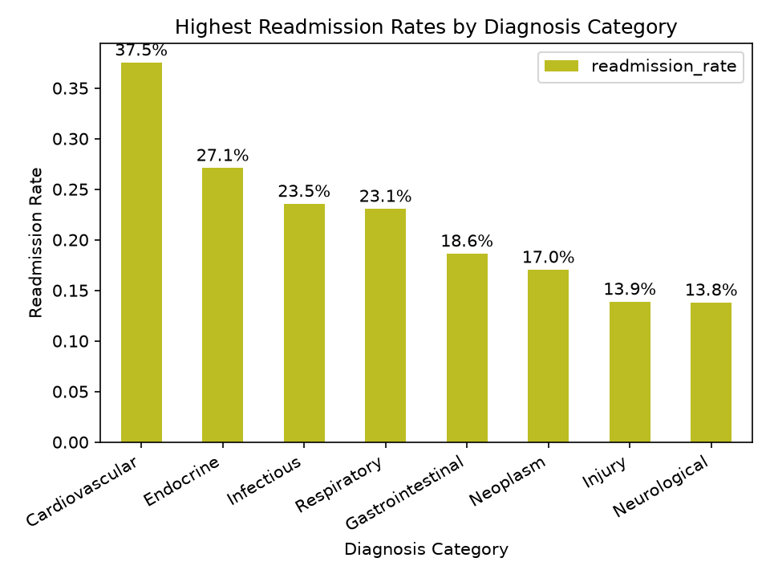
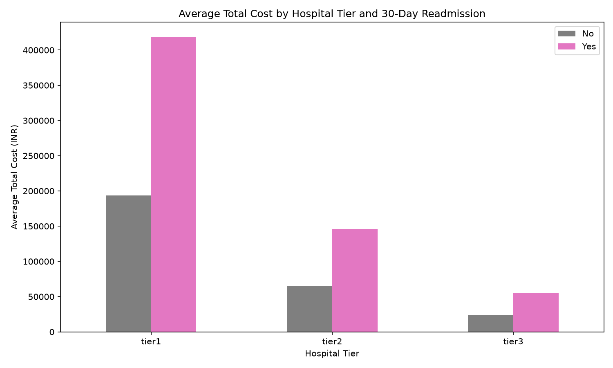
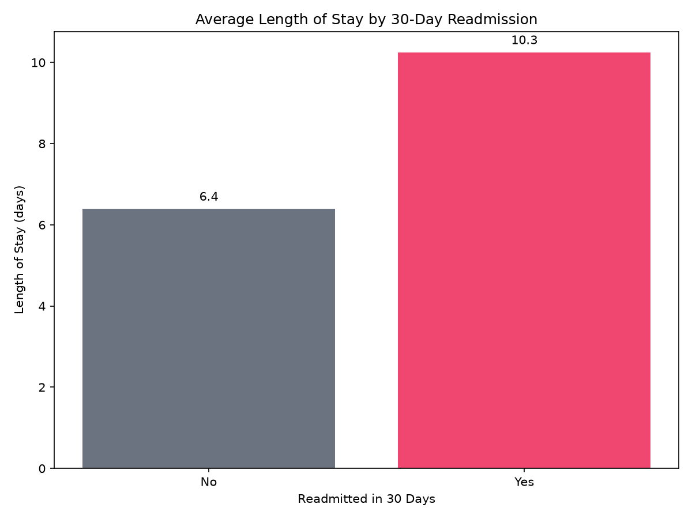
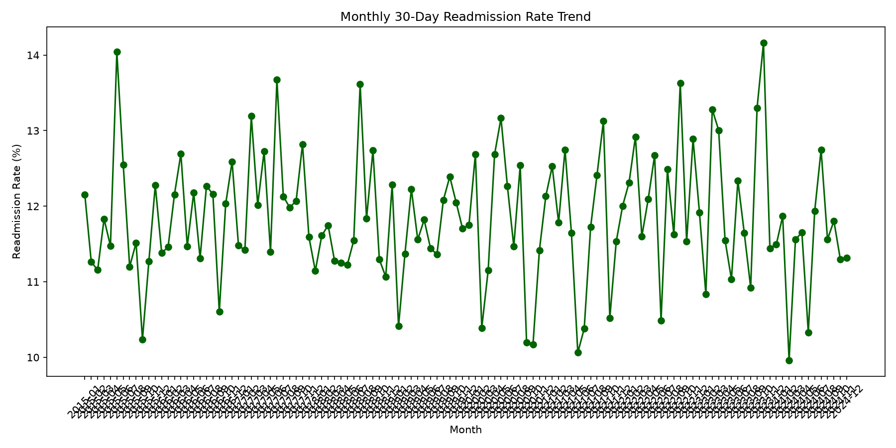

# Hospital Readmission Data Visualization Report

## Overview
This report examines 30-day and 7-day readmission patterns using the hospital readmission dataset. The analysis combines patient details, admission events, diagnosis categories, billing information, and hospital-level metadata.

## Key summary metrics
- Overall 30-day readmission rate: 11.84%
- Overall 7-day readmission rate: 0.84%
- Average length of stay: 6.85 days
- Average total cost per admission: ₹95,779.53

## Main insights
- The highest 30-day readmission risk appears in the 65+ age group at 20.4%.
- Insurance type Ayushman shows the highest observed readmission rate at 13.9%.
- The highest diagnosis-category readmission rate is Cardiovascular at 37.5%.
- Longer stays are generally associated with higher readmission exposure and higher care costs.
- Monthly readmission trends show whether care patterns are improving or worsening over time.

## Visual dashboard

## Interpretation
1. Age and insurance status appear to be meaningful risk stratification variables for readmission.
2. Diagnosis mix and hospital tier are useful for understanding cost and readmission variation.
3. The monthly trend helps detect seasonal or operational changes in patient outcomes.
4. Combining these variables supports a more evidence-based clinical and operational dashboard.
